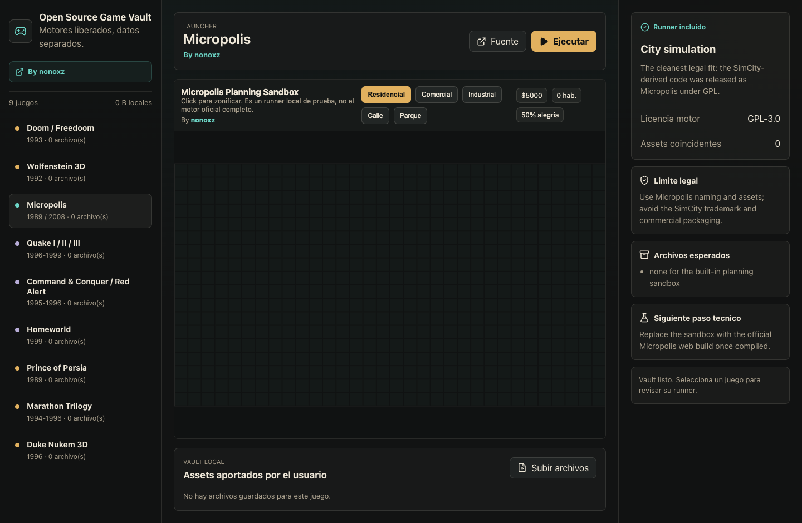

# Open Source Game Vault

Browser launcher for classic open-source game engines, built by [nonoxz](https://github.com/nonoxz).



## What This Is

Open Source Game Vault is a small web app for organizing and running classic game engines whose source code has been released.

It is intentionally legal-first:

- Open engine/source-port metadata can live in the app.
- Commercial game files are not included.
- Files such as WAD, PAK, PK3, GRP, BIG, MIX, maps, sounds, and art are uploaded by the user locally.
- Uploaded files stay in your browser through IndexedDB and are not sent to a server.

## What Works Now

- Game catalog for Wolfenstein 3D, Doom/Freedoom, Quake I/II/III, Micropolis, Command & Conquer/Red Alert, Homeworld, Prince of Persia, Marathon, and Duke Nukem 3D.
- Local asset vault with upload, file counts, sizes, and delete actions.
- Legal and technical notes for each game.
- Sandboxed runner system.
- A built-in Micropolis-style planning sandbox so the launcher has one playable local runner today.

The Micropolis sandbox is a proof of the runner model. It is not the full official Micropolis engine yet.

## Para Personas Que No Saben Compilar

No necesitas saber programar para probarlo. Hay dos caminos simples.

### Opcion 1: Usar El Sitio Web

Si GitHub Pages esta activado para este repositorio, abre:

https://nonoxz.github.io/open-source-game-vault/

Eso es todo: se usa desde el navegador. No hay que instalar compiladores ni abrir la terminal.

### Opcion 2: Ejecutarlo En Tu Computador

Instala Node.js desde:

https://nodejs.org/

Despues abre Terminal, copia y pega estos comandos:

```bash
git clone https://github.com/nonoxz/open-source-game-vault.git
cd open-source-game-vault
npm install
npm run dev
```

La terminal mostrara una direccion local, normalmente:

```text
http://localhost:5173/
```

Abre esa direccion en tu navegador.

## Using Game Files

Some games need original files that this project cannot legally include. Examples:

- Doom: `doom.wad`, `doom2.wad`, or a free compatible WAD such as Freedoom.
- Quake: `.pak` files.
- Duke Nukem 3D: `DUKE3D.GRP`.
- Homeworld: `Homeworld.big`.

Use the **Subir archivos** button in the app. Files stay in your browser storage.

## Add A Real Runner

For developers who want to connect a real WebAssembly/source-port engine:

1. Compile or provide a browser-safe build for the engine.
2. Place it under `public/runners/<game-id>/index.html`.
3. Add `runnerPath: '/runners/<game-id>/index.html'` in `src/data/games.ts`.
4. Keep commercial game data out of the repository.
5. Load user-provided data from browser storage, drag-and-drop, or a file picker.

## Development

```bash
npm install
npm run dev
```

## Build

```bash
npm run build
```

The static build is generated in `dist/`.

## Deploy To GitHub Pages

This repo includes `.github/workflows/deploy-pages.yml`.

In GitHub:

1. Open repository **Settings**.
2. Go to **Pages**.
3. Set the source to **GitHub Actions**.
4. Push to `main`.
5. Wait for the **Deploy GitHub Pages** workflow to finish.

## License

MIT License. See [LICENSE](LICENSE).
